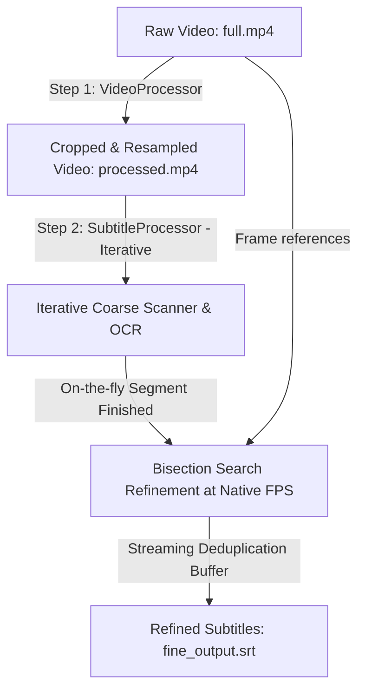

# Pipeline Architecture & Data Flow

This document details the high-level architecture of the subtitle extraction pipeline and maps out the data flow from raw video to refined SRT subtitle outputs.

---

## High-Level Execution Flow

The pipeline executes in two primary stages orchestrated by [main.py](file:///Users/an/Development/Subtitle/main.py):

---

## Pipeline Components

### 1. Step 1 — Video Pre-Processing (Crop & Resample)
* **Class**: `VideoProcessor` in [src/video.py](file:///Users/an/Development/Subtitle/src/video.py).
* **Process**:
  1. Seeks to the start timestamp in the raw video.
  2. Applies `CropStrategy` (typically bottom 20%, e.g., `top=0.80`) to isolate the subtitle region.
  3. Applies `FrameStrategy` (usually 1.0 fps or 2.0 fps) to downsample the frame rate.
  4. Writes the processed, small-footprint video file to `output/{timestamp}/processed.mp4`.
* **Rationale**: Downsampling and cropping drastically reduces disk size and CPU decoding overhead for the coarse pass, and isolates subtitles from bright backgrounds outside the lower screen region.

### 2. Step 2 & 3 — Iterative Subtitle Extraction & Refinement (On-the-Fly)
* **Class**: `SubtitleProcessor.process_iterative_subtitle` in [src/subtitle.py](file:///Users/an/Development/Subtitle/src/subtitle.py).
* **Process**:
  1. Reads downsampled `processed.mp4` frame by frame.
  2. Evaluates text presence using `has_subtitle(...)` and checks similarity using `CoverageCache`.
  3. Skips OCR on cache hits (`≥ 0.70`); runs `SubtitleOCR` (EasyOCR) on cache misses.
  4. As soon as a subtitle segment ends (or text changes), the pipeline immediately refines its boundaries at native FPS via bisection search using a center-distance reference frame.
  5. Feeds the refined subtitle into a streaming buffer.
  6. If the next refined subtitle matches the buffered subtitle and the gap is `≤ 2.0s`, it merges them on the fly. Otherwise, it prints the buffered subtitle to stdout and appends it to `fine_output.srt`.

