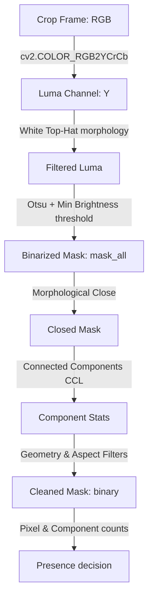

# Subtitle Presence Detection & Morphology

The presence detector isolates subtitle text from variable video backgrounds. It resides in [src/presence.py](file:///Users/an/Development/Subtitle/src/presence.py) and operates via a Morphological Top-Hat + Otsu Binarization + Connected Component Labeling (CCL) pipeline.

---

## The Presence Detection Pipeline



---

## Step-by-Step Morphology

### 1. Luma Channel Extraction
Subtitles are typically bright (white or yellow) text with dark outlines. To isolate brightness, the RGB frame is converted to the YCrCb color space, and the Y channel (Luma) is extracted:
```python
luma = cv2.cvtColor(frame, cv2.COLOR_RGB2YCrCb)[:, :, 0]
```

### 2. Resolution-Independent White Top-Hat
To separate thin, bright structures (text characters) from slowly varying backgrounds (e.g., bright clothing, skin tones, walls), the system applies a **White Top-Hat** filter. 
The structuring element kernel size is scaled proportionally to the original video height (referenced to $720p$):
\[\text{Kernel Size} = 19 \times \frac{\text{Original Height}}{720}\]
```python
top_hat = cv2.morphologyEx(luma, cv2.MORPH_TOPHAT, kernel_th)
```

### 3. Dual Thresholding (Otsu & Minimum Brightness)
Binarization is performed in two steps:
1. **Otsu Binarization**: Automatically calculates the optimal threshold on the Top-Hat image to isolate local bright peaks.
2. **Minimum Brightness Masking**: A static threshold of `50` is enforced to prevent Otsu from binarizing background noise on completely empty frames:
```python
_, mask = cv2.threshold(top_hat, 0, 255, cv2.THRESH_BINARY + cv2.THRESH_OTSU)
_, min_bright_mask = cv2.threshold(top_hat, 50, 255, cv2.THRESH_BINARY)
mask_all = cv2.bitwise_and(mask, min_bright_mask)
```

### 4. Morphological Close
A horizontal/vertical rectangular closing kernel is applied to merge isolated character strokes and character groupings:
```python
closed = cv2.morphologyEx(mask_all, cv2.MORPH_CLOSE, kernel_close)
```

---

## Connected Component Filtering (CCL)

We filter components based on size, border touching, aspect ratio, and fill density:

### 1. Border-Touching Rejection
Any component that touches the extreme left or right borders is rejected to prevent wide background segments (clothing boundaries, borders) from triggering detection.

### 2. Geometry Constraints
Components must satisfy these dimensions:
* **Height/Width**: $\ge 8$ pixels (scaled proportionally with original video height).
* **Aspect Ratio ($w/h$)**: $0.15 < \text{aspect} < 20.0$.
  * *Note*: The upper limit is set to `20.0` (rather than a lower limit like `6.0`) to prevent long text sentences from being rejected when characters merge into a single wide block.
* **Extent (Fill Density)**: $0.2 < \frac{\text{Area}}{w \times h} < 0.9$. This isolates structured characters from solid squares or extremely sparse noise.

### 3. Presence Decision
A frame contains a subtitle if:
1. The number of filtered text pixels (`strong_px`) is within the scaled range $[300, 15000]$ (scaled proportionally with the video resolution).
2. The number of kept components is $\ge 1$.
